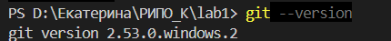
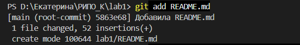
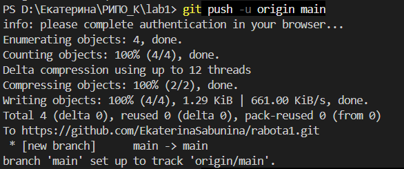
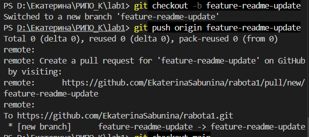
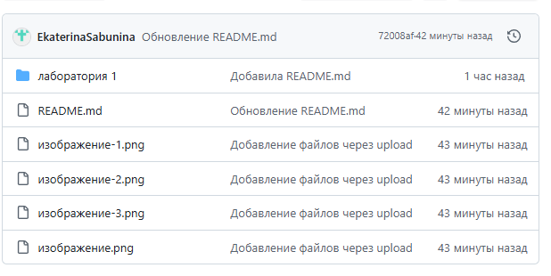

# Лабораторная работа №1

## Дисциплина: Разработка инструментального программного обеспечения

**Выполнила:** Екатерина Сабынина  
**Группа:** 222  
**GitHub:** https://github.com/EkaterinaSabunina/rabota1

---

## Описание проекта

Этот репозиторий создан для выполнения лабораторной работы №1. Здесь будут храниться все последующие лабораторные работы по курсу.

---

## Список выполненных действий

1. Установила Git.
2. Настроила глобальные параметры Git (user.name, user.email).
3. Создала репозиторий на GitHub с именем `rabota1`.
4. Склонировала репозиторий на локальный компьютер.
5. Создала файл `README.md`.
6. Добавила файл под версионный контроль (`git add`).
7. Сделала коммит (`git commit`).
8. Отправила изменения на GitHub (`git push`).
9. Создала новую ветку `feature-readme-update`.
10. Внесла изменения в `README.md` (добавила ссылку на GitHub).
11. Зафиксировала изменения и отправила ветку на удалённый сервер.

---

## Команды, использованные в терминале

| Команда | Назначение |
|---------|------------|
| `git --version` | Проверка версии Git |
| `git config --global user.name "Ekaterina Sabunina"` | Установка имени пользователя |
| `git config --global user.email` | Установка email |
| `git clone https://github.com/EkaterinaSabunina/rabota1.git` | Клонирование репозитория |
| `cd rabota1` | Переход в папку проекта |
| `git add README.md` | Добавление файла под контроль версий |
| `git commit -m "Добавлен README.md"` | Фиксация изменений |
| `git push` | Отправка изменений на GitHub |
| `git checkout -b feature-readme-update` | Создание и переход на новую ветку |
| `git push origin feature-readme-update` | Отправка ветки на GitHub |

---

## Ссылка на репозиторий

https://github.com/EkaterinaSabunina/rabota1
